# Learning React Tables
> I have made this project to learn about react tables

## Techs To Learn
> I will be learning these techs in this project
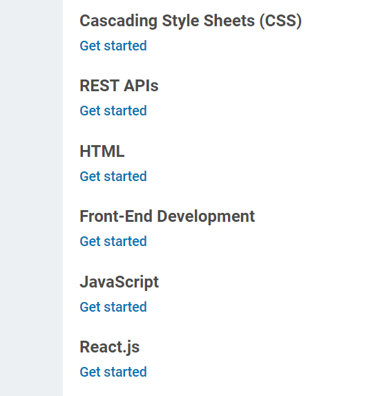

## Mock Data
> A mock data is taken for our use case from mockaroo.com with following settings
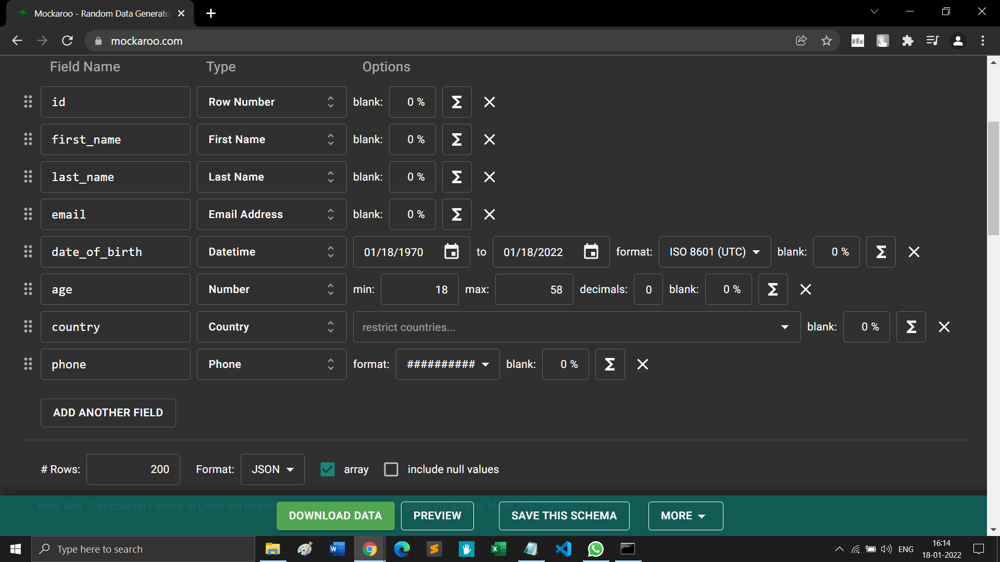

# THINGS LEARNT
> I have learnt the following things in this project.

## 1. Creating a basic table
> Follow the following steps to create a table in react.
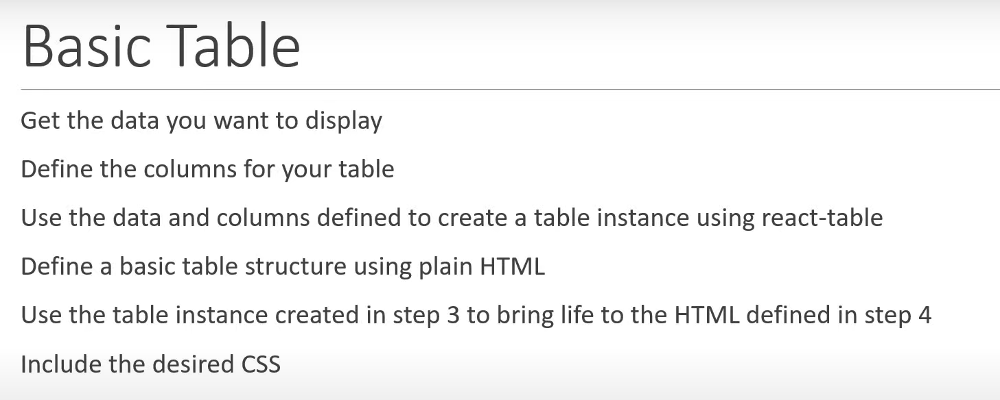
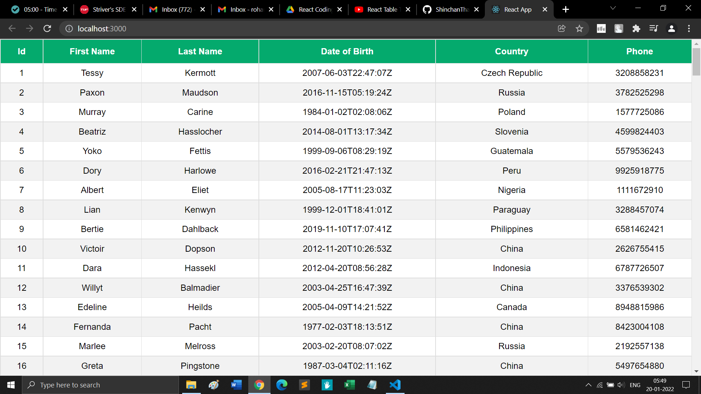

## 2. Adding Footers
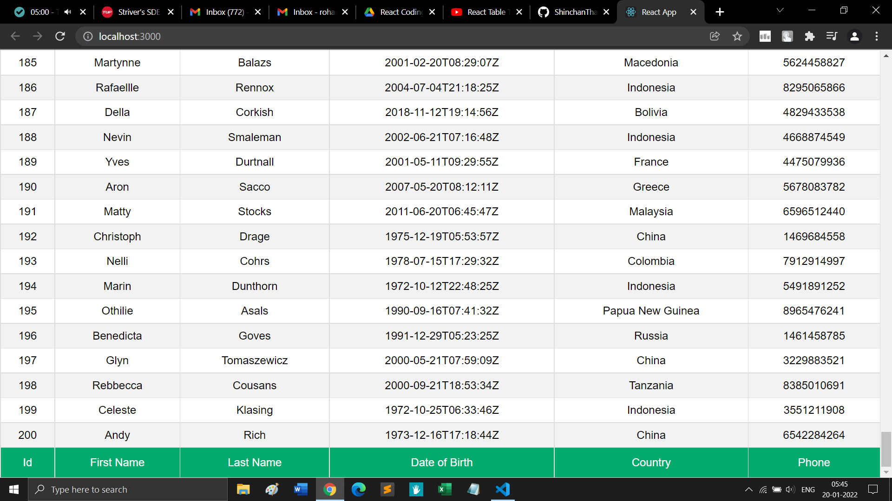

## 3. Grouping Headers
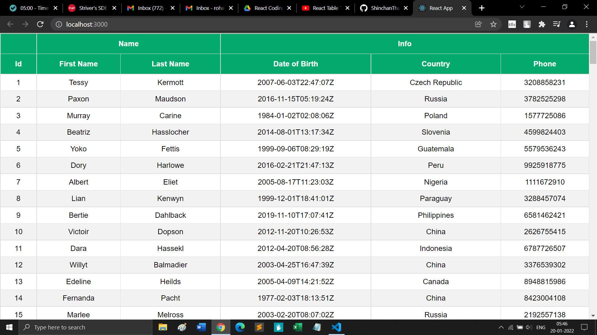

## 4. Adding sorting feature to each column
> Data is sorted by date of birth
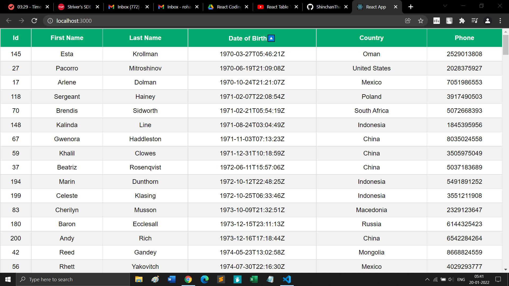

## 5. Formatting Columns
> Date column is formatted in dd/MM/yyyy format
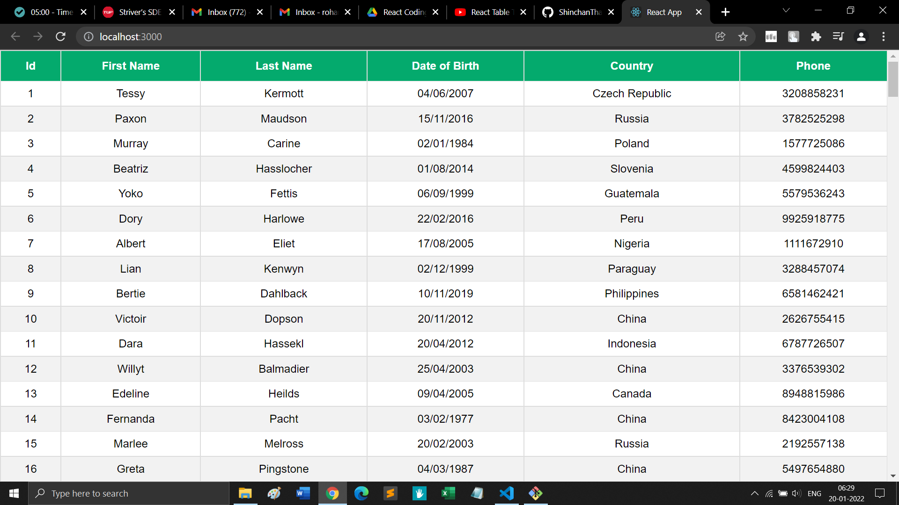

## 6. Filtering (Client Side)
> Global Filtering
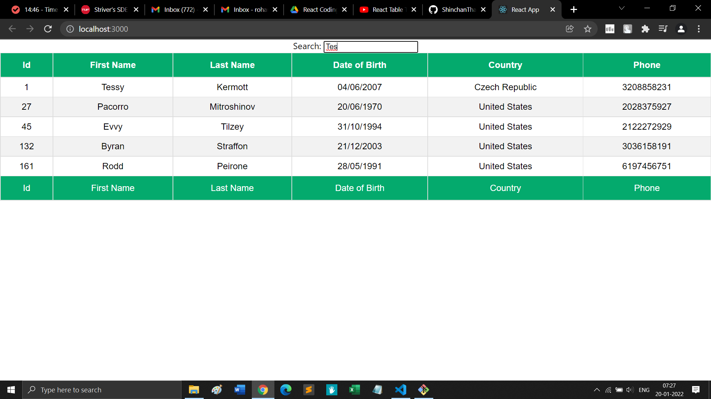

> Column Filtering
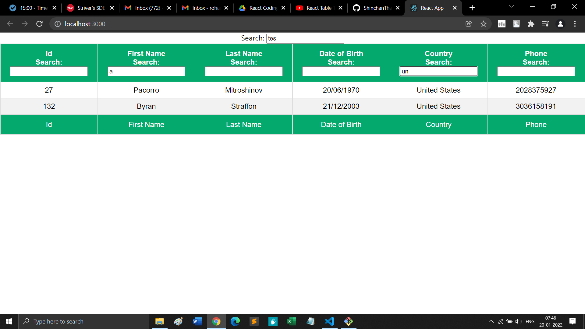

> Some perfomance and code improvements
1. Disable Filters in some columns
2. Set some common properties for all columns using defaultColumn property in useTable hook
3. Using asyncDebounce hook to filter data to improve performance

## 7. Pagination (Client Side)
> I learnt the following things in pagination
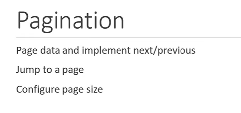
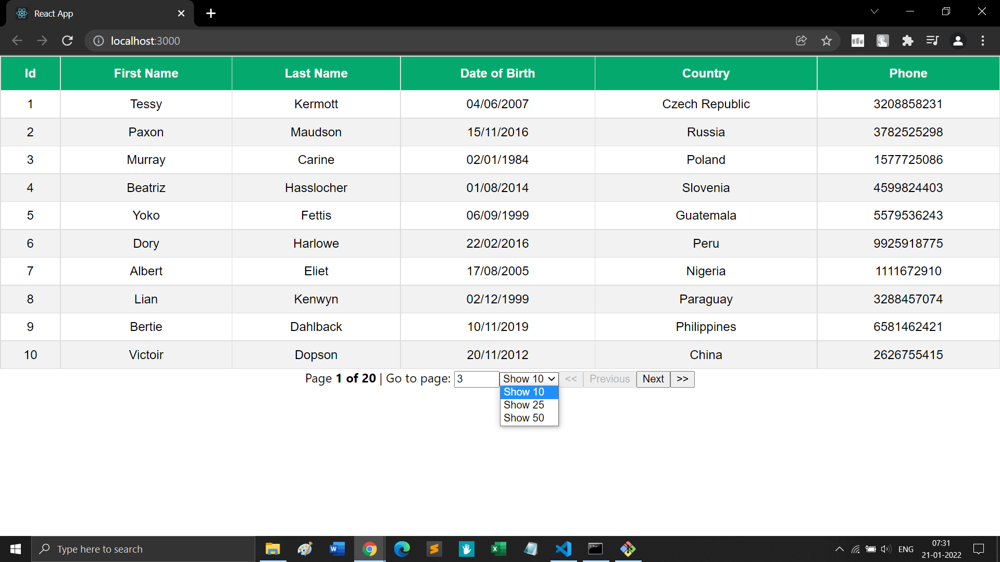

## 8. Selecting Rows
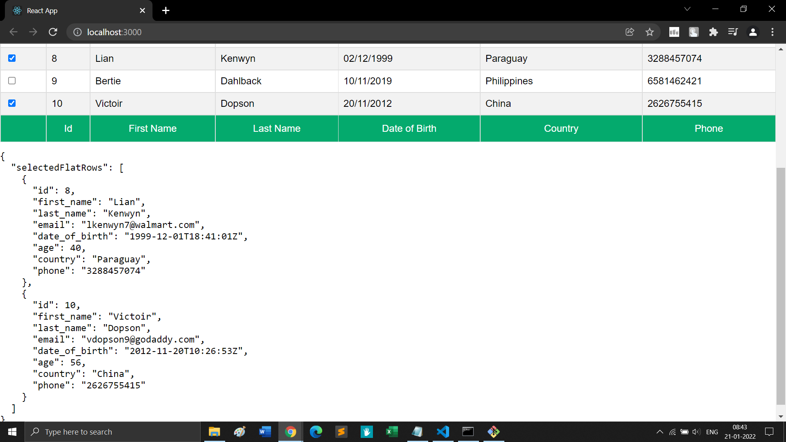

## 9. Change Column Order

## 10. Column Hiding
> Columns can be made visible or hidden according to the user's choice
